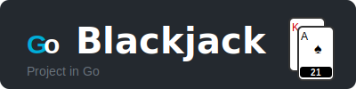

## Hey 👋, I'm Dev Patel!

I am a versatilist and easily adapt to different hats (Full Stack Web Developer 🌐, App Developer 📱, ML Engineer 🤖 or beginner level Designer 🎨) depending on what the project requires. I love exploring new tech stack 💻 and leveraging them to build cool stuffs 🛠️. 
 
 
  
### 🙋‍♂️ More About Me:

- 🧑‍🎓 &nbsp; I'm currently studying master of science in computer science from Indiana University - Bloomington
- 🔭 &nbsp; I’m currently working on [**blackjack AI game**](https://github.com/Devpatel1901/blackjack)
- 🤝 &nbsp; I’m looking to collaborate on a module developed on Go [cards](https://pkg.go.dev/github.com/Devpatel1901/cards/v2@v2.0.0)
- 🌱 &nbsp; I’m currently learning Golang, and exploring AI agents to update with latest AI trends.
- 👨🏻‍💻 &nbsp; Most of my projects are available on [Github](https://github.com/Devpatel1901?tab=repositories)
- 💬 &nbsp; Ask me about anything tech related, I am happy to help;
- 📫 &nbsp; Feel free to ping me on [LinkedIn](https://www.linkedin.com/in/dev-patel-540a84233/)
- 📝 &nbsp; Checkout my [resume](https://drive.google.com/file/d/1BugqrSl6I26i8G3iJ0IxM9_Fkv-oyoBf/view?usp=sharing)

 

### 🔨 Languages and Tools:
 
 

 
 

### 📊 Github Stats
  

</a>

 

### 🛠️ My Projects

<table>
  <tr>
    <td align="center">
      <a href="https://github.com/Devpatel1901/blackjack" target="_blank">
         
        <b>Blackjack AI</b>
      </a>
    </td>
    <td align="center">
      <a href="https://github.com/Devpatel1901/backops.ai" target="_blank">
         
        <b>BackOps.AI</b>
      </a>
    </td>
    <td align="center">
      <a href="https://github.com/Devpatel1901/CodeNexus" target="_blank">
         
        <b>CodeNexus</b>
      </a>
    </td>
  </tr>
</table>
